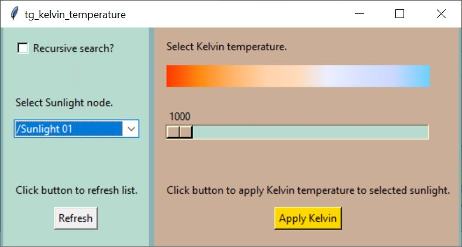

# tg-kelvin-temperature
A fully functional EXAMPLE Python script implementing Terragen 4 Professional’s remote procedure call (RPC) feature to allow the user to apply a kelvin temperature value to a selected Sunlight node in the active Terragen project.

This script incorporates Andreas Siess’s “RGB to Color Temperature” Python table.  See link below.

### Requirements:

Terragen 4 Professional v4.6.31 (or later)  
https://planetside.co.uk/

terragen-rpc  
https://github.com/planetside-software/terragen-rpc

Pillow  
https://pypi.org/project/Pillow/

### Installation:
Make sure you’ve installed Terragen 4 Professional v4.6.31 or greater on your computer, and installed the terragen_rpc module and Pillow fork, via the pip install command.

In this repository you’ll find the Python script “tg_kelvin_temperature.py” and supporting example content. The images folder contains an icon file, should you wish to create a shortcut on your desktop for the python script.

### Usage:

<ul>
<li>To modify a Sunlight node’s colour value, select it from the drop-down list.</li>
<li>Select a Kelvin temperature value by dragging the slider to the left or right. </li>
<li>Click the Apply Kelvin button to apply the selected Kelvin temperature value to the Sunlight node’s colour parameter.</li>
<li>Click the Refresh button to update the drop-down list with the current Sunlight nodes in the active Terragen project.</li>
<li>When the “Recursive search?” checkbox is checked, all Sunlight nodes in the project will be found.  When unchecked, only Sunlight nodes at the root-level of the project will be found.  </li>  
</ul>

### Reference:

terragen-rpc  
https://github.com/planetside-software/terragen-rpc

Online documentation for Terragen RPC 
https://planetside.co.uk/docs/terragen-rpc/

Blog posts on using Terragen RPC 
https://planetside.co.uk/blog/script-it-yourself-kelvin-sunlight-colour-with-terragen-rpc/  
https://planetside.co.uk/blog/hello-rpc-part-1-scripting-for-terragen/  
https://planetside.co.uk/blog/hello-rpc-part-2-error-handling/

Andreas Siess’s “RGB to color temperature” Python table  
https://andi-siess.de/rgb-to-color-temperature/
